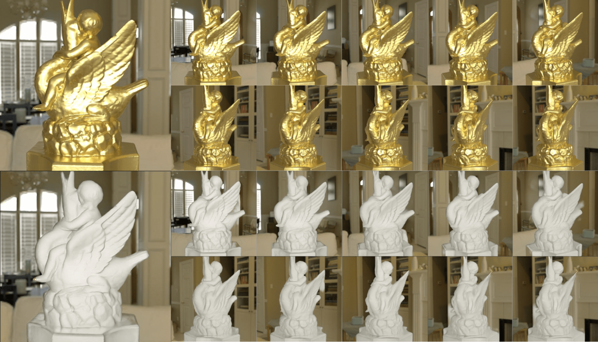
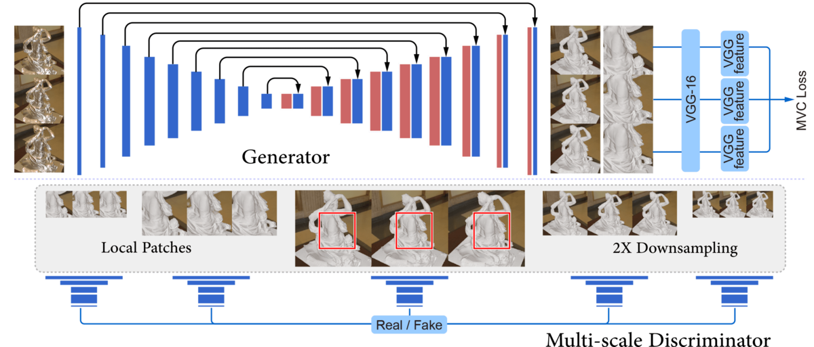

# S2Dnet

[Specular-to-Diffuse Translation for Multi-View Reconstruction](https://www.dropbox.com/s/ouvm6hh7ge5zdwy/S2Dnet.pdf?dl=0) 
<br/>
[Shihao Wu](http://shihaowu.net/)<sup> 1</sup>, [Hui Huang](http://vcc.szu.edu.cn/~huihuang/)<sup> 2</sup>, [Tiziano Portenier](http://www.cgg.unibe.ch/staff/tiziano-portenier)<sup> 1</sup>, [Matan Sela](http://matansela.strikingly.com/)<sup> 3</sup>, [Daniel Cohen-Or](https://www.cs.tau.ac.il/~dcor/)<sup> 4</sup>, [Ron Kimmel](http://www.cs.technion.ac.il/~ron/)<sup> 3</sup>, and [Matthias Zwicker](http://www.cs.umd.edu/~zwicker/)<sup> 5</sup>    <br/>
<sup>1 </sup>University of Bern, <sup>2 </sup>Shenzhen University, <sup>3 </sup>Technion - Israel Institute of Technology, <sup> 4 </sup>Tel Aviv University, <sup>5 </sup>University of Maryland  <br/>
European Conference on Computer Vision (ECCV), 2018 

<p align="center"></p>

<p align="center"></p>

<br/>


<br/>

## Dependencies

* [Python](https://www.continuum.io/downloads)
* [PyTorch](http://pytorch.org/)
* [TensorFlow](https://www.tensorflow.org/) (optional for tensorboard)
* [PBRT](http://pbrt.org/scenes-v3.html) (optional for rendering)
* [CycleGAN](https://github.com/junyanz/CycleGAN) (our code is based on this implementation)

### Downloading (Dropbox links)

* [Large multi-view synthetic training data (172 GB)](https://www.dropbox.com/s/0l146k934t8tqqi/huge_uni_render_rnn.zip?dl=0)
* [Small multi-view synthetic training data (3 GB)](https://www.dropbox.com/s/uv8onade36v6pto/tiny_uni_render_rnn.zip?dl=0)
* [Some single-view synthetic training data (40 GB)](https://www.dropbox.com/s/q8hdta85etv1tja/uni_render_single.zip?dl=0)
* [Real training data (7GB)](https://www.dropbox.com/s/0n1ifpurunmdgvo/all_angel_data.zip?dl=0) 

* [Some Synthetic testing data (1 GB)](https://www.dropbox.com/s/zfd8p5qwwolr6yx/test_data_rendered.zip?dl=0) 
* [Some Real testing data](https://www.dropbox.com/s/xcc0ywhcb5nuntz/test_data_real.zip?dl=0) 

* [Aligned 3D models for rendering (1.8 GB)](https://www.dropbox.com/s/jno3g7867ysvsy6/geometry.zip?dl=0) 
* [Environment maps for rendering](https://www.dropbox.com/s/13asq10w7x6vame/textures.zip?dl=0) 

* [Pretrained networks using pix2pix](https://www.dropbox.com/s/4a060ze3f1qnxav/trained_pix2pix.zip?dl=0) 
* [Pretrained networks using cycleGAN](https://www.dropbox.com/s/kuh94wtjezz8txs/trained_cyclegan.zip?dl=0) 
* [Pretrained networks using S2Dnet](https://www.dropbox.com/s/tmkrt7llqasjres/trained_ours.zip?dl=0) 

* [Some Reconstruction results of Real Data](https://www.dropbox.com/sh/v4684bsbwpz58cp/AACtXNfp7FVtx3TaUiX7_BwCa?dl=0) 
* [Some Reconstruction results of Synthetic Data](https://www.dropbox.com/sh/y0bgn5w9t0wpjqd/AAB_j1hsa2fzL5X59bF8Y4bna?dl=0) 


### Training example

```bash
$ python train.py --dataroot ../huge_uni_render_rnn --logroot ./logs/job101CP --name job_submit_101C_re1_pixel --model cycle_gan --no_dropout --loadSize 512 --fineSize 512 --patchSize 256 --which_model_netG unet_512_Re1 --which_model_netD patch_512_256_multi_new --lambda_A 10 --lambda_B 10 --lambda_vgg 5 --norm pixel
```


### Testing

Please refer to "./useful_scripts/evaluation/"

Scripts of SIFT, SMVS, and rendering are in "./useful_scripts/". 

Please contact the author for more information about the code and data.


